# 👋 Hi, I'm Yahya Zakaria Elyan
### Graduate Software & Backend Engineer | MSc Computer Science (Merit)

  
  
  
  

---

## 👨‍💻 Professional Summary

Software Engineering Graduate (MSc Computer Science with Merit, University of Dundee; BSc Electrical Engineering, Cairo University) with commercial software testing experience and hands-on backend engineering expertise across Python, FastAPI, PostgreSQL, Docker, AWS EC2, and PyTest.

Skilled in containerizing RESTful microservices, designing relational schemas, training NLP inference pipelines, and deploying cloud applications via Nginx and GitHub Actions CI/CD. Brings commercial experience in QA defect reporting and transaction validation from NCR Alteos, applying disciplined engineering practices, automated testing (PyTest/TDD), and continuous delivery.

---

## 🛠️ Technical Skills

| Domain | Technologies & Tools |
|---|---|
| **Core Languages** | Python, SQL, C/C++, JavaScript, HTML5, CSS3, working knowledge of C#, Kotlin, JavaScript and Java|
| **Backend & REST APIs** | FastAPI, RESTful API Design, JWT Auth & OAuth 2.0, Middleware, Nginx |
| **Databases & Data** | PostgreSQL, MySQL, SQLite, MongoDB, Relational Schema Design, Pandas, NumPy |
| **Cloud & DevOps** | AWS EC2, IAM Policies, Security Groups, Docker, GitHub Actions CI/CD, Linux (Ubuntu), Git |
| **AI & Machine Learning** | PyTorch, Hugging Face (RoBERTa, BERT), TensorFlow Lite, OpenNSFW2, WD14 Tagger, scikit-learn |
| **Testing & Quality** | PyTest (TDD), Unit & Integration Testing, API Validation, Defect Logging & QA Workflows |

---

## 🌟 Featured Engineering Projects

### 🛡️ 1. Aegis: Digital Shield (Architecture Showcase)

> **Repository Link:** [`yzes95/project-aegis-showcase`](https://github.com/yzes95/project-aegis-showcase)  
> **Tech Stack:** React Native, Kotlin (Android), C# .NET WPF (Windows), FastAPI, PostgreSQL, TensorFlow Lite, PyTest

* **Hybrid On-Device AI Architecture:** Multi-crop screen classification running entirely offline (TensorFlow Lite, MobileNetV2, OpenNSFW2, WD14 Tagger) to guarantee 100% user screen privacy.
* **2-Tier Dynamic Pipeline:** Combines a 21-crop Sentinel classifier with a 6,000-tag single-pass decision tree to achieve 96%+ precision and eliminate false positives on safe media.
* **OS-Level Self-Defense:** C# WPF Win32 process control routines with Mutual Watchdog process revival & Win32 DACL process locks on Windows, coupled with native Kotlin Accessibility Service node scanners and multi-pattern OEM settings interceptors on Android.
* **API Contracts & PyTest Suite:** FastAPI backend with PostgreSQL, Google OAuth 2.0, JWT token rotation, and TDD-driven PyTest integration test suites.
* **Skills Learned & Engineering Outcomes:** Mastered Win32 P/Invoke security descriptors, Android Accessibility hooks across OEM skins, privacy-first computer vision pipelines, and multi-platform system architecture.

---

### 🤝 2. Ataa (عطاء): Fintech Donation & Direct Humanitarian Aid Platform (In Progress)
 

> **Repositories & Live Demo:** [`yzes95/Donation-Platform`](https://github.com/yzes95/Donation-Platform) (Frontend PWA) | [`yzes95/Donation-Platform-Backend`](https://github.com/yzes95/Donation-Platform-Backend) (FastAPI Service) | [Live Web App](https://yzes95.github.io/Donation-Platform/)  
> **Tech Stack:** React 19, Vite, Tailwind CSS, PWA (Service Workers), FastAPI, PostgreSQL, Framer Motion, Recharts, i18next (Arabic/English RTL), Docker, AWS

* **Multi-Role Donation Experience:** Designing a responsive PWA covering donor interactions, family-representative management, and administrative verification and monitoring workflows.
* **Direct Family Assistance & Targeted Donations:** Connects donors with verified family assistance cases, allowing contributions to be directed toward specific needs and services rather than general fundraising.
* **Family & Assistance Management Backend:** Developing a FastAPI REST backend with PostgreSQL to manage family representatives, assistance requests, donation records, and transaction data.
* **Donation & Transaction Tracking:** Implementing donation workflows with anonymous/public contribution options, transaction references, status tracking, and structured donation history.
* **AWS-Ready Cloud Architecture:** Designing the application for AWS deployment using Docker, IAM, S3, and CloudFormation, establishing an infrastructure-as-code approach for reproducible cloud resources.
  
---

### 🧠 3. Argument Mining Classifier & REST API (MSc Dissertation)
 

> **Repositories:** [`yzes95/Argument-Mining`](https://github.com/yzes95/Argument-Mining) (Model Training) | [`yzes95/Argument-Mining-API`](https://github.com/yzes95/Argument-Mining-API) (FastAPI Service)  
> **Tech Stack:** PyTorch, RoBERTa, BERT, scikit-learn, FastAPI, Docker, PyTest, Google Colab (NVIDIA T4 GPU)

* **NLP Model Benchmarking:** Designed and evaluated three end-to-end argument classification pipelines: SVM baseline, BERT feature extraction + SVM, and a fine-tuned RoBERTa model trained on AAEC and UKP benchmark datasets.
* **Containerized Inference REST API:** Exposed model inference via a modular FastAPI REST service with Pydantic request and response schemas.
* **Testing & GPU Acceleration:** Validated sentence segmentation and model inference with PyTest suites; executed GPU-accelerated transformer fine-tuning on Google Colab.

---

### 🎬 4. MoodVie: Emotion-Based Recommendation Platform

> **Repository & Live Site:** [`yzes95/MoodVi`](https://github.com/yzes95/MoodVi) | [Live Web App](https://yzes95.github.io/MoodVi/)  
> **Tech Stack:** JavaScript (ES6+), HTML5, CSS3, Tailwind CSS, Flowbite, TMDB REST API, Gemini AI API

* **Emotion-Driven Discovery:** Customer-facing recommendation platform integrating Gemini AI model prompts to convert natural language emotional input into TMDb genre classifications.
* **TMDB API & Video Integration:** Dynamic movie discovery fetching posters, ratings, and YouTube trailer embeds, backed by a client-side keyword sentiment fallback engine for 100% uptime reliability.
* **Watchlist Persistence:** Saves user favorites in local storage with interactive modal popups and responsive grid layouts.

---

### 🕹️ 5. CatHunt: 2D Platformer Adventure (Python & Pygame)

> **Repository Link:** [`yzes95/Cat_Hunt_V1_Python`](https://github.com/yzes95/Cat_Hunt_V1_Python)  
> **Tech Stack:** Python 3, Pygame, PyTest, CSV I/O

* **Game Engine Architecture:** 2D adventure game built using Pygame featuring sprite animation loops, collision detection, parallax background scrolling, and audio state managers.
* **Player Data & Testing:** Stored user profiles and high scores in CSV files; validated key utility functions using PyTest (`test_project.py`).

---

### 🏥 6. Curaflux: Healthcare Workforce Matching Platform
> **Tech Stack:** Python, MySQL, REST APIs, Git, Agile (Scrum)

* **Relational Schema Design:** Co-designed a normalized MySQL database schema representing healthcare worker availability, shift requirements, and matching relationships.
* **Agile Backend Sprints:** Built modular backend routing services and middleware within an Agile Scrum team, delivering REST endpoints across iterative sprints.

---

## 💼 Professional Experience

**Operations Tester** | *NCR Alteos (via Key Personnel)*  
*Jan 2026 - Apr 2026*
* Executed structured transaction test scripts across commercial ATM software/hardware workflows, capturing reproduction steps and logging defects for engineering teams.
* Applied disciplined QA processes, API testing, automated PyTest suites, and systematic debugging across financial technology software.

**Team Co-Leader** | *Green Valley Oil Services / Saknafta Services*  
*Jun 2023 - Dec 2024*
* Coordinated technical operational activities, equipment diagnostics, safety audits, and risk assessment in high-pressure engineering environments.

---

## 📊 GitHub Analytics & Visuals

  
  

  

---

## 💬 Connect With Me

* 🌐 **Portfolio Website:** [yahya-porto.onrender.com](https://yahya-porto.onrender.com/)
* 👔 **LinkedIn Profile:** [linkedin.com/in/yahya-zakaria-elyan-salman-b1b99a163](https://tinyurl.com/YahyaLinkedIn)
* 📧 **Email Address:** [yahya.jobs@outlook.com](mailto:yahya.jobs@outlook.com)
* 🐙 **GitHub Profile:** [@yzes95](https://github.com/yzes95)
